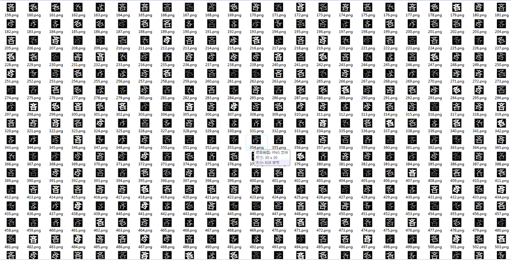
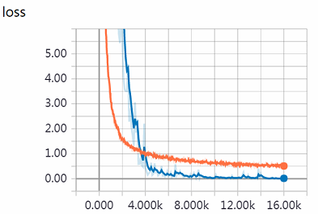
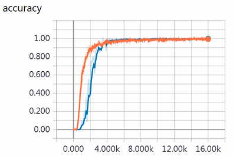
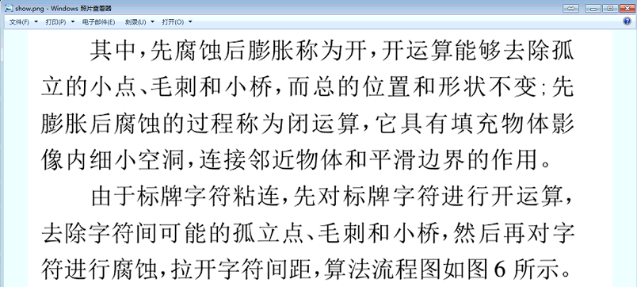
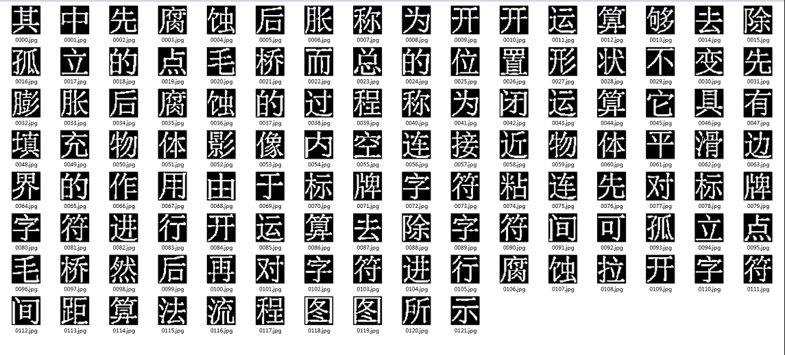
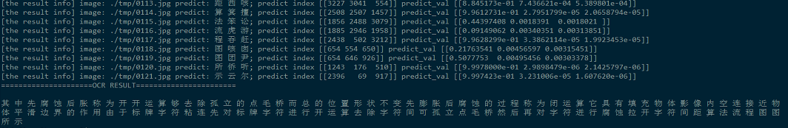

# CPS-OCR-Engine
forked An awesome OCR engine developed by SYSU DeepDriving Lab

## 修改如下：
支持 python3.5
修改运行环境，gpu cuda版本限制

### 增加训练集生成脚本 gen_labs.py,可修改字符范围
### 修改训练图片生成方法，使用随机角度，腐蚀和膨胀，先做相反操作，避免腐蚀到失去信息，或者膨胀到过度连接
### 修改训练范围 ascii 33-126，可见字符
### 训练模型， 0 O 在 step=7000左右可区分

## 原始内容

一个基于深度学习的文字识别系统，支持3755个（一级字库）的印刷体汉字识别。

因为近期在帮学校财务处审计处设计智能票据识别系统（已经支持数十类票据啦），需要用到OCR去识别一些汉字，做智能信息录入。对于汉字的识别，我尝试过Tessercact，实在太烂，
也试过百度的ocr接口，但是感觉不太适合（第一是要钱的，第二毕竟是别人的API，想优化也优化不了），那就自己搞一搞基于深度学习的OCR引擎吧，算是锻炼一下自己。

 

这个OCR模型专注于电子文档、证件、票据的汉字识别。

*** top 1 accuracy 0.99826 top 5 accuracy 0.99989 ***

### 数据合成
```
python gen_printed_char.py --out_dir ./dataset --font_dir ./chinese_fonts --width 30 --height 30 --margin 4 --rotate 30 --rotate_step 1
```
合成效果
<div align="center">

</div>

### 训练
```
python Chinese_OCR.py --mode=train --max_steps=16002 --eval_steps=100 --save_steps=500
```

### 模型评估
```
python Chinese_OCR.py --mode=validation
```

### 线上预测
要识别的图像往tmp目录下扔就行了。
```
 python Chinese_OCR.py --mode=inference 
```

### 效果
<div align="center">


</div>


我从某篇论文中截图一小段文字，并做了单字切割，送入模型进行OCR预测。
<div align="center">


</div>


识别结果全部正确！
<div align="center">

</div>


更多细节请访问我的博客：http://www.cnblogs.com/skyfsm/p/8443107.html

最后分享一下我的模型：链接：https://pan.baidu.com/s/1eTmm0eQ 密码：m7ns
